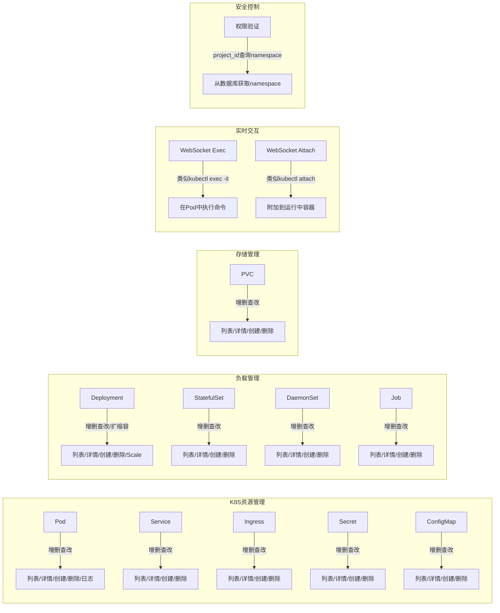
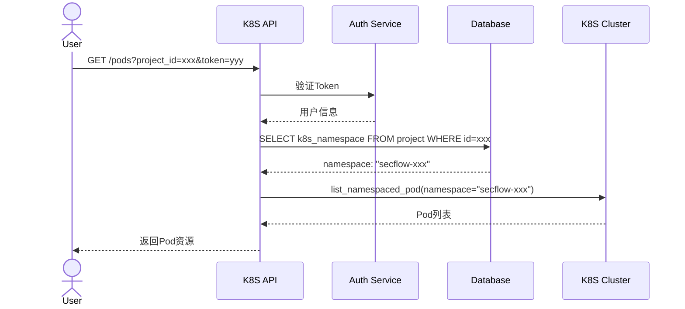
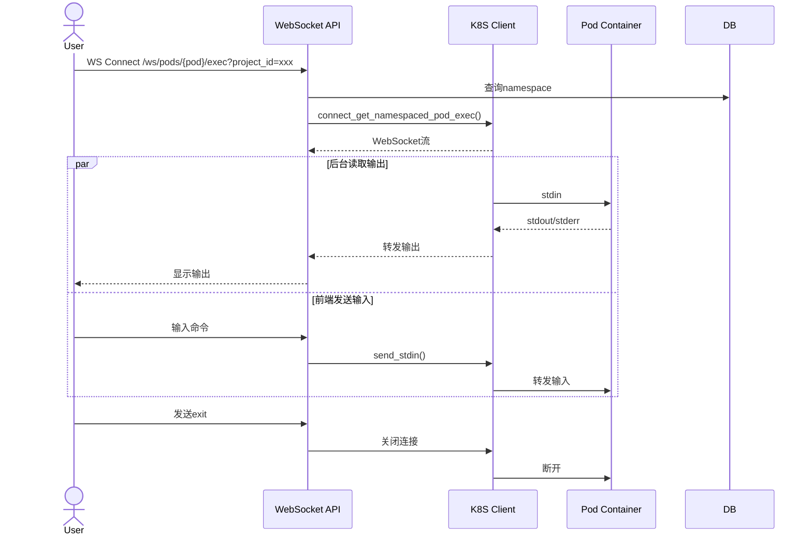
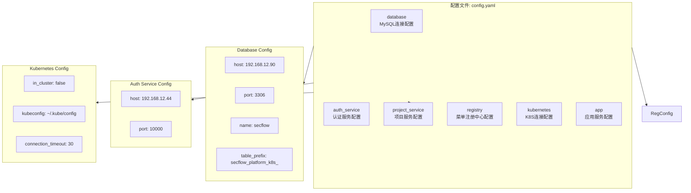

# SecFlow K8S 资源管理服务架构图

## 系统架构概览

```mermaid
flowchart TB
    subgraph External["外部系统"]
        AuthService["SecFlow Auth Service<br/>(认证服务)"]
        MenuService["SecFlow Menu Service<br/>(菜单注册中心)"]
        K8SCluster["Kubernetes Cluster<br/>(K8S集群)"]
        MySQL["MySQL Database<br/>(数据持久化)"]
    end

    subgraph K8SService["SecFlow K8S 资源管理服务<br/>:10005"]
        subgraph APILayer["API 层 (FastAPI)"]
            PodAPI["/api/k8s/pods<br/>Pod管理"]
            ServiceAPI["/api/k8s/services<br/>Service管理"]
            IngressAPI["/api/k8s/ingresses<br/>Ingress管理"]
            SecretAPI["/api/k8s/secrets<br/>Secret管理"]
            ConfigMapAPI["/api/k8s/configmaps<br/>ConfigMap管理"]
            DeploymentAPI["/api/k8s/deployments<br/>Deployment管理"]
            StatefulSetAPI["/api/k8s/statefulsets<br/>StatefulSet管理"]
            DaemonSetAPI["/api/k8s/daemonsets<br/>DaemonSet管理"]
            JobAPI["/api/k8s/jobs<br/>Job管理"]
            PVCAPI["/api/k8s/pvcs<br/>PVC管理"]
            WSExecAPI["/api/k8s/ws/pods/{name}/exec<br/>WebSocket Exec"]
            WSAttachAPI["/api/k8s/ws/pods/{name}/attach<br/>WebSocket Attach"]
        end

        subgraph ServiceLayer["服务层"]
            AuthServiceClient["Auth Service Client<br/>(认证客户端)"]
            RegistryService["Registry Service<br/>(服务注册)"]
            K8SClient["K8S Client<br/>(K8S资源操作)"]
            ProjectServiceClient["Project Service Client<br/>(项目服务)"]
        end

        subgraph DataLayer["数据层 (SQLAlchemy)"]
            DB[(Database<br/>数据库)]
            ProjectModel["Project<br/>(项目模型-复用project服务)"]
        end
    end

    %% 外部连接
    AuthService <-->|"Token验证<br/>HTTP /api/auth/validate-human-token"| AuthServiceClient
    MenuService <-->|"服务注册/心跳/下线<br/>HTTP /api/menu/*"| RegistryService
    K8SCluster <-->|"Pod/Service/Ingress/Secret/<br/>ConfigMap/Deployment/StatefulSet/<br/>DaemonSet/Job/PVC<br/>K8S API"| K8SClient
    MySQL <-->|"CRUD操作<br/>MySQL TCP"| DB

    %% API层连接
    PodAPI --> ProjectModel
    ServiceAPI --> ProjectModel
    DeploymentAPI --> ProjectModel

    %% 服务层连接
    APILayer -.->|"依赖注入"| ServiceLayer
    K8SClient --> K8SClient
    ProjectServiceClient --> ProjectModel

    %% 认证流程
    APILayer -.->|"JWT Token验证"| AuthServiceClient

    classDef external fill:#e1f5fe,stroke:#01579b,stroke-width:2px
    classDef api fill:#fff3e0,stroke:#ef6c00,stroke-width:2px
    classDef service fill:#e8f5e9,stroke:#2e7d32,stroke-width:2px
    classDef data fill:#f3e5f5,stroke:#6a1b9a,stroke-width:2px

    class AuthService,MenuService,K8SCluster,MySQL external
    class PodAPI,ServiceAPI,IngressAPI,SecretAPI,ConfigMapAPI,DeploymentAPI api
    class AuthServiceClient,RegistryService,K8SClient,ProjectServiceClient service
    class DB,ProjectModel data
```



---

## 核心模块说明



---

## 项目Namespace映射流程



---

## WebSocket Exec 交互流程



---

## 配置说明



---

## 技术栈

| 层级 | 技术 |
|------|------|
| **Web框架** | FastAPI + Uvicorn |
| **数据库** | MySQL + SQLAlchemy |
| **配置** | PyYAML + Pydantic |
| **K8S交互** | kubernetes-python |
| **认证** | httpx (异步HTTP) |
| **WebSocket** | websocket-client |
| **基础镜像** | python:3.11-slim |

---

## 核心特性

1. **Namespace安全映射**: 通过project_id从数据库查询namespace，不直接使用前端传递的namespace
2. **完整K8S资源管理**:
   - Pod/Service/Ingress/Secret/ConfigMap 增删查改
   - Deployment/StatefulSet/DaemonSet/Job/PVC 增删查改
   - Deployment扩缩容
3. **实时交互能力**:
   - WebSocket Exec: 类似kubectl exec -it在Pod中执行命令
   - WebSocket Attach: 类似kubectl attach附加到运行中容器
4. **Pod日志获取**: 支持获取容器日志包含历史日志
5. **认证授权**: 基于JWT Token的用户认证和项目权限验证
6. **服务注册**: 自动向菜单中心注册服务并发送心跳

---

## 目录结构

```
secflow-platform-k8s/
├── app/
│   ├── api/
│   │   ├── __init__.py
│   │   └── k8s_resources.py   # K8S资源API路由
│   ├── models/
│   │   ├── __init__.py
│   │   └── database.py        # 数据库模型(复用Project表)
│   ├── schemas/
│   │   ├── __init__.py
│   │   └── k8s_schemas.py     # Pydantic模型定义
│   ├── services/
│   │   ├── __init__.py
│   │   ├── auth.py             # 认证服务
│   │   ├── project.py         # 项目服务客户端
│   │   └── k8s.py              # K8S客户端
│   ├── config.py               # 配置管理
│   ├── exception.py           # 异常处理
│   ├── main.py                # 应用入口
│   └── __init__.py
├── config.yaml                # 配置文件
├── Dockerfile                 # Docker构建文件
├── requirements.txt           # Python依赖
├── start.py                  # 启动脚本
└── doc/
    ├── ARCHITECTURE.md       # 本文档
    └── API.md               # API参考文档
```

---

## 权限验证流程

1. 用户请求携带 Authorization Token
2. 验证Token获取用户信息
3. 根据project_id从数据库查询项目信息
4. 验证用户有权限访问该项目
5. 通过项目ID获取K8S Namespace
6. 对Namespace下的资源进行操作

---

## K8S资源操作

### Pod管理
- 列表/详情/创建/删除
- 获取容器列表
- 获取日志
- WebSocket Exec实时交互
- WebSocket Attach实时交互

### Service管理
- 列表/详情/创建/删除

### Ingress管理
- 列表/详情/创建/删除

### Secret管理
- 列表/详情/创建/删除

### ConfigMap管理
- 列表/详情/创建/删除

### Deployment管理
- 列表/详情/创建/删除
- 扩缩容(scale)

### StatefulSet管理
- 列表/详情/创建/删除

### DaemonSet管理
- 列表/详情/创建/删除

### Job管理
- 列表/详情/创建/删除

### PVC管理
- 列表/详情/创建/删除