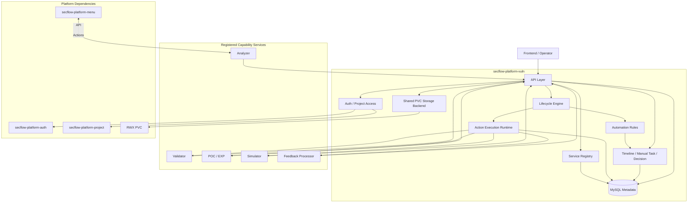

# SecFlow 漏洞生命周期编排引擎架构设计

## 1. 设计目标

`secflow-platform-vuln` 的目标不是“实现一种漏洞能力”，而是提供一个平台级漏洞生命周期引擎。

目标包括：

- 用统一模型承接不同漏洞能力服务
- 用统一状态机驱动漏洞生命周期
- 用统一 `Action/Result` 契约协调外部执行
- 用统一时间线和人工任务承接自动化与人工协作
- 用统一附件与元数据支撑前端展示和长期扩展

## 2. 角色划分

### 2.1 平台引擎负责

- 服务注册与能力发现
- 生命周期状态机
- `Action` 派发与运行记录
- `Result` 收敛与自动规则推进
- 人工任务、人工裁决、项目级运营视图
- 审计与时间线
- 平台附件元数据与共享存储抽象

### 2.2 外部能力服务负责

- 漏洞分析
- AI 分析
- 静态分析
- 逆向分析
- 黑盒/运行时验证
- POC/EXP 生成
- 仿真与 Proof 验证
- 反馈优化处理

### 2.3 平台当前不负责

- 去重实现
- 扫描器本身
- POC/EXP 生成执行
- 固化源码/二进制等漏洞结构
- 对象存储后端实现

## 3. 总体架构

## 4. 生命周期模型

当前主阶段：

1. `ingest`
2. `normalize`
3. `route`
4. `analyze`
5. `verify`
6. `prove`
7. `decide`
8. `track`
9. `archive`

含义：

- `ingest`
  - 平台接收新漏洞事实，创建 `Case`
- `normalize`
  - 统一补齐平台级元数据
- `route`
  - 根据阶段和能力服务决定可派发动作
- `analyze`
  - 进入分析类能力阶段
- `verify`
  - 进入验证和仿真能力阶段
- `prove`
  - 进入 POC/EXP/Proof 阶段
- `decide`
  - 进入人工裁决或决策收敛阶段
- `track`
  - 进入反馈、跟踪和后续运营阶段
- `archive`
  - 归档

## 5. 自动规则设计

当前引擎已经实现第一版自动规则：

- `Case` 创建后自动从 `ingest -> normalize`
- `Result` 携带 `suggested_stage` 时自动推进阶段
- `normalize/route` 收到结果时默认推进到 `analyze`
- `analyze` 收到结果时默认推进到 `verify`
- `verify` 收到 `poc/exp` 结果时可推进到 `prove`
- `poc/exp` 成功结果会推进到 `decide`
- 明确的 `confirmed/false_positive/accepted_risk` 会推进到 `track`
- `failed` 结果会自动生成 `manual_validation` 任务
- 低置信度成功结果会自动生成 `manual_review` 任务
- 规则命中会写入 `automation_rule_applied` 时间线事件

## 6. Action/Result 模型

### 6.1 Action

平台把所有外部调度都抽象为 `ActionExecution`。

关键字段：

- `action_type`
- `target_service_id`
- `capability_code`
- `dispatch_status`
- `execution_status`
- `input_meta_json`
- `input_artifact_refs_json`
- `retry_count`
- `timeout_at`

### 6.2 Result

外部服务统一通过回调提交结果，平台统一保存为 `Result`。

关键字段：

- `result_type`
- `status`
- `summary`
- `confidence`
- `result_meta_json`
- `raw_payload_json`
- `artifact_refs_json`
- `suggested_stage`
- `suggested_decision`

这让平台不需要知道“这个结果到底来自源码扫描、逆向分析还是 POC 生成”，只需要统一承接元数据。

## 7. 服务注册与能力发现

每个外部能力服务需要先注册到平台：

- `service_id`
- `service_name`
- `service_type`
- `endpoint`
- `healthcheck_url`
- `callback_mode`
- `auth_mode`
- `version`
- `capabilities`

每个 capability 包含：

- `capability_code`
- `action_type`
- `priority`
- `timeout_seconds`
- `concurrency_limit`
- `input_schema_meta`
- `output_schema_meta`

平台基于注册能力提供：

- 手动按路由派发
- 当前阶段推荐动作
- 一键自动编排

## 8. 数据模型

统一表前缀：`secflow_vuln_`

当前核心表：

- `secflow_vuln_case`
- `secflow_vuln_case_event`
- `secflow_vuln_service_registry`
- `secflow_vuln_service_capability`
- `secflow_vuln_workflow_definition`
- `secflow_vuln_workflow_run`
- `secflow_vuln_action_execution`
- `secflow_vuln_result`
- `secflow_vuln_artifact`
- `secflow_vuln_stage_history`
- `secflow_vuln_manual_task`

保留但尚未全面启用的设计位：

- 决策增强
- 反馈实体
- 评论实体
- 关系实体
- 去重框架字段

## 9. 元数据设计

平台尽量不把漏洞域做死，统一使用元数据承载：

- `source_meta_json`
- `target_meta_json`
- `display_meta_json`
- `result_meta_json`
- `raw_payload_json`
- `artifact_refs_json`
- `context_json`

这让前端可以按能力增强展示：

- 能识别 HTTP、代码片段、POC 结果时走增强渲染
- 不能识别时退化为通用 JSON/文本/附件展示

## 10. 存储设计

当前实现：

- k8s 多实例共享一个 RWX PVC
- 平台文件元数据保存在 `secflow_vuln_artifact`
- 平台文件后端抽象为共享 PVC

设计目标：

- 当前适配 k8s 多副本
- 未来可平滑切换到 S3/MinIO
- 不复用分析类资源服务存储

## 11. 前端工作台信息架构

当前前端已实现漏洞引擎工作台，主要视图包括：

- 总览
- Case 运行
- 能力服务
- 人工任务
- Action 队列

核心交互包括：

- 创建 Case
- 注册服务
- 查看推荐动作
- 一键自动编排
- 模拟外部回调
- Action 重试/取消
- 人工任务推进
- 人工裁决

## 12. k8s 部署拓扑

当前部署要点：

- `secflow-platform-vuln` Deployment 多副本
- 独立 `Service`
- 独立 `/api/vuln` Ingress 前缀
- 独立 RWX PVC
- `health` / `ready` 探针

当前线上镜像标签已同步为：

- `ghcr.io/runshine/secflow-platform-vuln:20260322`
- `ghcr.io/runshine/secflow-frontend:20260322`

## 13. 演进方向

建议后续继续演进：

- 把自动规则从代码提取为可配置策略
- 引入真实附件上传与读取接口
- 补全反馈、评论、关系实体
- 引入对象存储后端
- 增加前端路由级多页工作台
- 增加更细粒度的能力运行监控
