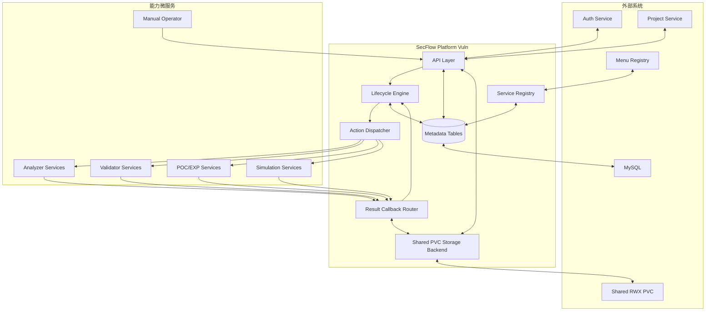

# SecFlow 漏洞生命周期编排引擎架构设计

## 1. 定位

`secflow-platform-vuln` 是漏洞生命周期编排引擎，而不是单一漏洞分析微服务。

平台职责：

- 注册并管理外部漏洞能力微服务
- 驱动漏洞生命周期流程自动化运转
- 派发 Action 并接收结果回调
- 汇聚分析、验证、POC、EXP、仿真、反馈等结果
- 提供统一的时间线、决策、审计和人工介入框架

平台不负责：

- 自身完成漏洞分析
- 自身生成 POC 或 EXP
- 自身实现去重
- 强制定义源码/二进制等固定漏洞结构

## 2. 系统架构

## 3. 核心对象

### 3.1 Case

漏洞主对象，表示平台层面的生命周期管理单元。

### 3.2 Workflow Run

一个 Case 对应一次生命周期运行实例，用于保存当前阶段和上下文。

### 3.3 Action Execution

平台派发给外部能力服务的执行单元。

### 3.4 Result

外部能力服务回传的统一结果对象。

### 3.5 Artifact

平台自己的附件对象，当前存储在共享 PVC 中，后续可平滑切换到 S3。

## 4. 生命周期阶段

第一版主阶段如下：

1. `ingest`
2. `normalize`
3. `route`
4. `analyze`
5. `verify`
6. `prove`
7. `decide`
8. `track`
9. `archive`

说明：

- `route` 是平台调度入口
- `analyze`、`verify`、`prove` 支持并行和重复进入
- 外部服务和人工都可以驱动阶段推进

## 5. 数据模型

统一表前缀：`secflow_vuln_`

核心表：

- `secflow_vuln_case`
- `secflow_vuln_case_event`
- `secflow_vuln_service_registry`
- `secflow_vuln_service_capability`
- `secflow_vuln_workflow_definition`
- `secflow_vuln_workflow_run`
- `secflow_vuln_action_execution`
- `secflow_vuln_result`
- `secflow_vuln_artifact`
- `secflow_vuln_stage_history`
- `secflow_vuln_decision`
- `secflow_vuln_manual_task`
- `secflow_vuln_feedback`
- `secflow_vuln_comment`
- `secflow_vuln_relation`

## 6. 存储设计

当前阶段：

- k8s 多实例共享同一个 RWX PVC
- 平台文件目录基于 `project_id/case_id/artifact_id` 组织

后续扩展：

- 存储接口抽象为 `StorageBackend`
- 新增 `S3StorageBackend` 后无须改变业务模型

## 7. 去重框架

平台只预留去重字段与关系，不在当前版本实现去重逻辑。

保留字段：

- `dedup_status`
- `dedup_meta`
- `canonical_case_id`
- `dedup_group_id`

## 8. 设计原则

- 平台负责编排，不与具体能力强耦合
- 结果以元数据和统一回调结构保存
- 前端展示按能力增强，后端不固化细分漏洞类型
- 所有扩展优先通过注册能力和 Action/Result 契约接入
