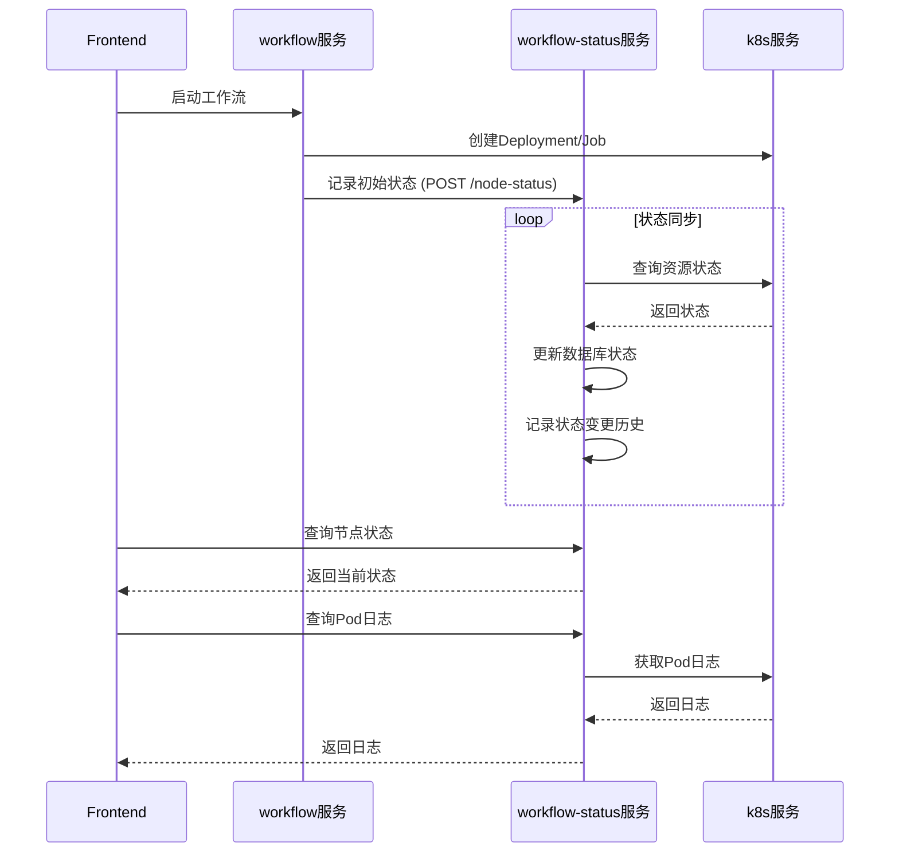

# 节点状态管理功能抽离设计文档

## 1. 概述

### 1.1 背景

当前 `secflow-platform-workflow` 微服务承担了过多职责：
- 工作流编排和调度
- K8S 资源创建/删除
- 节点状态同步和查询
- 日志查询
- 状态统计

为了实现更好的微服务职责分离，需要将**节点状态管理**相关功能抽离到独立的 `secflow-platform-workflow-status` 微服务中。

### 1.2 目标

1. **职责分离**：workflow 专注于编排，workflow-status 专注于状态管理
2. **服务解耦**：通过 HTTP API 进行服务间通信
3. **性能优化**：状态查询可独立扩展
4. **可维护性**：降低单个服务的复杂度

## 2. 现状分析

### 2.1 当前架构

```
┌─────────────────────────────────────────────────────────────┐
│              secflow-platform-workflow                       │
│  ┌─────────────────────────────────────────────────────┐   │
│  │              WorkflowEngine                          │   │
│  │    - execute_workflow()     工作流执行               │   │
│  │    - sync_node_status_from_k8s()  状态同步 ★         │   │
│  │    - sync_all_nodes_status()  批量同步 ★             │   │
│  │    - _update_workflow_status()  状态聚合 ★           │   │
│  └─────────────────────────────────────────────────────┘   │
│  ┌─────────────────────────────────────────────────────┐   │
│  │              K8SServiceClient                        │   │
│  │    - get_deployment_status()  Deployment状态 ★       │   │
│  │    - get_job_status()  Job状态 ★                     │   │
│  │    - get_pod_logs()  Pod日志 ★                       │   │
│  └─────────────────────────────────────────────────────┘   │
└─────────────────────────────────────────────────────────────┘
                              │
                              ▼
                    ┌─────────────────┐
                    │ secflow-platform│
                    │      -k8s       │
                    └─────────────────┘
```

### 2.2 需要抽离的核心功能

| 功能 | 当前位置 | 代码位置 |
|------|----------|----------|
| 节点状态同步 | WorkflowEngine.sync_node_status_from_k8s() | workflow_engine.py:184-275 |
| 批量状态同步 | WorkflowEngine.sync_all_nodes_status() | workflow_engine.py:277-286 |
| 工作流状态聚合 | WorkflowEngine._update_workflow_status() | workflow_engine.py:288-376 |
| Deployment状态查询 | K8SServiceClient.get_deployment_status() | k8s_service_client.py:315-338 |
| Job状态查询 | K8SServiceClient.get_job_status() | k8s_service_client.py:612-640 |
| Pod日志查询 | K8SServiceClient.get_pod_logs() | k8s_service_client.py:668-689 |

### 2.3 状态定义

**工作流状态 (WorkflowStatus)**:
```
pending -> initializing -> initialized -> running -> succeeded/failed/stopped
```

**节点状态 (NodeStatus)**:

| 节点类型 | 状态 | 说明 |
|----------|------|------|
| APP | pending | Pod未运行 |
| APP | not_ready | Pod已运行但未就绪 |
| APP | ready | Pod全部就绪 |
| APP | stopped | 已停止 |
| JOB | pending | 等待执行 |
| JOB | running | 执行中 |
| JOB | succeeded | 执行成功 |
| 通用 | failed | 执行失败 |

## 3. 目标架构

### 3.1 服务职责划分

```
┌──────────────────────────────┐    ┌──────────────────────────────┐
│  secflow-platform-workflow    │    │ secflow-platform-workflow-   │
│                               │    │         status               │
│  职责：                        │    │                              │
│  - 工作流编排和调度            │    │  职责：                       │
│  - K8S资源创建/删除            │◄──►│  - 节点状态查询和同步         │
│  - 依赖管理和执行              │    │  - 状态历史记录               │
│  - 触发器管理                  │    │  - 状态统计                   │
│                               │    │  - 日志查询代理               │
│  API:                         │    │                              │
│  - 创建/删除工作流             │    │  API:                        │
│  - 初始化/启动/停止            │    │  - 查询节点状态               │
│  - 更新工作流配置              │    │  - 同步节点状态               │
│                               │    │  - 查询状态历史               │
└──────────────────────────────┘    │  - 获取状态统计               │
         │                           │  - 获取Pod日志                │
         │                           └──────────────────────────────┘
         │                                      │
         │                                      │
         ▼                                      ▼
┌─────────────────────────────────────────────────────────────┐
│                    secflow-platform-k8s                      │
│                    (K8S资源管理服务)                          │
└─────────────────────────────────────────────────────────────┘
```

### 3.2 服务间通信



## 4. API 设计

### 4.1 workflow-status 服务新增 API

#### 4.1.1 节点状态管理

```yaml
# 同步单个节点状态（由workflow服务调用）
POST /api/workflow-status/nodes/{node_id}/sync
Request:
  project_id: string  # 项目ID
  instance_id: string  # 工作流实例ID
  node_type: string    # app/job
  k8s_resource_name: string  # K8S资源名称
Response:
  node_id: string
  status: string
  message: string
  started_at: datetime
  finished_at: datetime

# 批量同步工作流下所有节点状态
POST /api/workflow-status/instances/{instance_id}/sync-all
Request:
  project_id: string
  nodes: list  # 节点列表
Response:
  instance_id: string
  workflow_status: string
  nodes: list  # 更新后的节点状态列表

# 获取节点状态
GET /api/workflow-status/nodes/{node_id}
Query:
  project_id: string
  instance_id: string
Response:
  node_id: string
  node_type: string
  status: string
  k8s_resource_name: string
  started_at: datetime
  finished_at: datetime
  message: string

# 获取工作流所有节点状态
GET /api/workflow-status/instances/{instance_id}/nodes
Query:
  project_id: string
Response:
  instance_id: string
  workflow_status: string
  nodes: list

# 记录节点初始状态（创建时调用）
POST /api/workflow-status/nodes
Request:
  node_id: string
  instance_id: string
  project_id: string
  node_type: string
  k8s_resource_name: string
  initial_status: string
Response:
  success: boolean
  node_id: string

# 更新节点状态（停止、删除时调用）
PUT /api/workflow-status/nodes/{node_id}
Request:
  status: string
  message: string
Response:
  success: boolean
```

#### 4.1.2 日志查询

```yaml
# 获取节点日志
GET /api/workflow-status/nodes/{node_id}/logs
Query:
  project_id: string
  tail_lines: int (default: 100)
  container: string (optional)
  previous: boolean (default: false)
Response:
  node_id: string
  logs: string
  pod_name: string
```

#### 4.1.3 状态历史

```yaml
# 获取节点状态变更历史
GET /api/workflow-status/nodes/{node_id}/history
Query:
  project_id: string
Response:
  node_id: string
  history: list  # 状态变更记录列表

# 获取工作流状态变更历史
GET /api/workflow-status/instances/{instance_id}/history
Query:
  project_id: string
Response:
  instance_id: string
  history: list
```

#### 4.1.4 统计信息

```yaml
# 获取项目工作流状态统计
GET /api/workflow-status/statistics
Query:
  project_id: string
  start_time: datetime (optional)
  end_time: datetime (optional)
Response:
  total_workflows: int
  total_nodes: int
  status_distribution: dict
  success_rate: float
```

### 4.2 workflow 服务修改

#### 4.2.1 移除的功能

从 `WorkflowEngine` 中移除：
- `sync_node_status_from_k8s()`
- `sync_all_nodes_status()`
- `_update_workflow_status()`

从 `K8SServiceClient` 中移除：
- `get_deployment_status()`（状态查询相关）
- `get_job_status()`（状态查询相关）
- `get_pod_logs()`

#### 4.2.2 新增的客户端

```python
# app/services/workflow_status_client.py

class WorkflowStatusClient:
    """Workflow Status 微服务客户端"""

    def __init__(self):
        self.base_url = config.workflow_status_service.base_url
        self.client = httpx.AsyncClient(timeout=30)

    async def sync_node_status(
        self,
        node_id: str,
        project_id: str,
        instance_id: str,
        node_type: str,
        k8s_resource_name: str
    ) -> dict:
        """同步单个节点状态"""
        url = f"{self.base_url}/api/workflow-status/nodes/{node_id}/sync"
        response = await self.client.post(url, json={
            "project_id": project_id,
            "instance_id": instance_id,
            "node_type": node_type,
            "k8s_resource_name": k8s_resource_name
        })
        return response.json()

    async def sync_all_nodes(
        self,
        instance_id: str,
        project_id: str,
        nodes: list
    ) -> dict:
        """同步工作流所有节点状态"""
        url = f"{self.base_url}/api/workflow-status/instances/{instance_id}/sync-all"
        response = await self.client.post(url, json={
            "project_id": project_id,
            "nodes": nodes
        })
        return response.json()

    async def record_node_initial_status(
        self,
        node_id: str,
        instance_id: str,
        project_id: str,
        node_type: str,
        k8s_resource_name: str,
        initial_status: str = "pending"
    ) -> dict:
        """记录节点初始状态"""
        url = f"{self.base_url}/api/workflow-status/nodes"
        response = await self.client.post(url, json={
            "node_id": node_id,
            "instance_id": instance_id,
            "project_id": project_id,
            "node_type": node_type,
            "k8s_resource_name": k8s_resource_name,
            "initial_status": initial_status
        })
        return response.json()

    async def update_node_status(
        self,
        node_id: str,
        status: str,
        message: str = None
    ) -> dict:
        """更新节点状态"""
        url = f"{self.base_url}/api/workflow-status/nodes/{node_id}"
        response = await self.client.put(url, json={
            "status": status,
            "message": message
        })
        return response.json()

    async def get_node_logs(
        self,
        node_id: str,
        project_id: str,
        tail_lines: int = 100,
        container: str = None
    ) -> dict:
        """获取节点日志"""
        url = f"{self.base_url}/api/workflow-status/nodes/{node_id}/logs"
        params = {"project_id": project_id, "tail_lines": tail_lines}
        if container:
            params["container"] = container
        response = await self.client.get(url, params=params)
        return response.json()
```

## 5. 数据模型

### 5.1 workflow-status 服务数据模型

```python
# app/models/database.py

class NodeStatusRecord(Base):
    """节点状态记录"""
    __tablename__ = "secflow_node_status_record"

    id = Column(String(64), primary_key=True)
    node_id = Column(String(64), nullable=False, index=True)
    instance_id = Column(String(64), nullable=False, index=True)
    project_id = Column(String(32), nullable=False, index=True)
    node_type = Column(String(20), nullable=False)  # app/job

    # K8S资源信息
    k8s_resource_name = Column(String(128))
    k8s_resource_type = Column(String(20))  # Deployment/Job

    # 状态信息
    status = Column(String(32), nullable=False, default="pending")
    started_at = Column(DateTime)
    finished_at = Column(DateTime)
    duration_seconds = Column(Integer)
    message = Column(Text)

    # 扩展信息
    extra_data = Column("metadata", JSON)

    created_at = Column(DateTime, default=datetime.utcnow)
    updated_at = Column(DateTime, default=datetime.utcnow, onupdate=datetime.utcnow)


class WorkflowStatusRecord(Base):
    """工作流状态记录"""
    __tablename__ = "secflow_workflow_status_record"

    id = Column(String(64), primary_key=True)
    instance_id = Column(String(64), nullable=False, index=True)
    project_id = Column(String(32), nullable=False, index=True)

    # 状态信息
    status = Column(String(32), nullable=False, default="pending")
    started_at = Column(DateTime)
    finished_at = Column(DateTime)
    duration_seconds = Column(Integer)
    message = Column(Text)

    # 节点状态汇总
    total_nodes = Column(Integer, default=0)
    pending_nodes = Column(Integer, default=0)
    running_nodes = Column(Integer, default=0)
    succeeded_nodes = Column(Integer, default=0)
    failed_nodes = Column(Integer, default=0)

    created_at = Column(DateTime, default=datetime.utcnow)
    updated_at = Column(DateTime, default=datetime.utcnow, onupdate=datetime.utcnow)


class NodeStatusHistory(Base):
    """节点状态变更历史"""
    __tablename__ = "secflow_node_status_history"

    id = Column(Integer, primary_key=True, autoincrement=True)
    node_id = Column(String(64), nullable=False, index=True)
    instance_id = Column(String(64), nullable=False, index=True)
    project_id = Column(String(32), nullable=False, index=True)

    from_status = Column(String(32))
    to_status = Column(String(32), nullable=False)
    reason = Column(Text)
    operator = Column(String(64))  # system/user

    created_at = Column(DateTime, default=datetime.utcnow)
```

## 6. 状态同步逻辑迁移

### 6.1 原 workflow_engine.py 中的状态同步逻辑

```python
# 原代码位置：workflow_engine.py:184-275

async def sync_node_status_from_k8s(self, node: WorkflowNodeInstance):
    """
    Sync node status from K8S to database

    For APP nodes:
    - PENDING: Pod未运行
    - NOT_READY: Pod已运行但未就绪
    - READY: Pod全部就绪

    For JOB nodes:
    - PENDING: 等待执行
    - RUNNING: 执行中
    - SUCCEEDED: 执行成功
    - FAILED: 执行失败
    """
    # ... 具体实现
```

### 6.2 迁移到 workflow-status 服务

```python
# secflow-platform-workflow-status/app/services/status_sync_service.py

class StatusSyncService:
    """状态同步服务"""

    def __init__(self):
        self.k8s_client = get_k8s_service_client()

    async def sync_node_status(
        self,
        node_id: str,
        project_id: str,
        instance_id: str,
        node_type: str,
        k8s_resource_name: str,
        timeout_seconds: int = None
    ) -> dict:
        """
        同步单个节点状态

        返回更新后的状态信息
        """
        db = get_db_session()
        try:
            # 获取当前状态记录
            record = db.query(NodeStatusRecord).filter(
                NodeStatusRecord.node_id == node_id
            ).first()

            if not record:
                raise ValueError(f"Node status record not found: {node_id}")

            # 从K8S获取实际状态
            if node_type == "app":
                k8s_status = self.k8s_client.get_deployment_status(
                    project_id, k8s_resource_name
                )
                new_status = self._determine_app_node_status(
                    k8s_status, record.status
                )
            else:  # job
                k8s_status = self.k8s_client.get_job_status(
                    project_id, k8s_resource_name
                )
                new_status = self._determine_job_node_status(
                    k8s_status, record.status, timeout_seconds, record.started_at
                )

            # 检查状态是否变化
            if new_status["status"] != record.status:
                # 记录状态变更历史
                self._record_status_history(
                    db, node_id, instance_id, project_id,
                    record.status, new_status["status"], new_status.get("message")
                )

                # 更新状态记录
                record.status = new_status["status"]
                record.message = new_status.get("message")
                if new_status.get("started_at"):
                    record.started_at = new_status["started_at"]
                if new_status.get("finished_at"):
                    record.finished_at = new_status["finished_at"]

                db.commit()

            return record.to_dict()

        finally:
            db.close()

    def _determine_app_node_status(
        self,
        k8s_status: dict,
        current_status: str
    ) -> dict:
        """确定APP节点状态"""
        if not k8s_status:
            return {
                "status": "failed",
                "message": "Deployment not found"
            }

        # STOPPED状态的节点不自动更新
        if current_status == "stopped":
            return {"status": current_status, "message": "Node is stopped"}

        replicas = k8s_status.get("replicas", 0)
        ready_replicas = k8s_status.get("ready_replicas", 0)
        available_replicas = k8s_status.get("available_replicas", 0)

        if ready_replicas >= replicas and replicas > 0:
            return {"status": "ready", "message": "Deployment is ready"}
        elif available_replicas > 0 or ready_replicas > 0:
            return {
                "status": "not_ready",
                "message": f"Deployment running but not ready ({ready_replicas}/{replicas})"
            }
        else:
            return {
                "status": "pending",
                "message": f"Waiting for Pod to start ({ready_replicas}/{replicas})"
            }

    def _determine_job_node_status(
        self,
        k8s_status: dict,
        current_status: str,
        timeout_seconds: int,
        started_at: datetime
    ) -> dict:
        """确定JOB节点状态"""
        if not k8s_status:
            return {"status": "failed", "message": "Job not found"}

        # 检查超时
        if started_at and timeout_seconds:
            elapsed = (datetime.utcnow() - started_at).total_seconds()
            if elapsed > timeout_seconds and k8s_status.get("status") in ["Pending", "Running"]:
                return {
                    "status": "failed",
                    "message": f"Job timeout after {elapsed:.0f}s",
                    "finished_at": datetime.utcnow()
                }

        k8s_job_status = k8s_status.get("status", "")

        if k8s_job_status == "Succeeded":
            return {
                "status": "succeeded",
                "message": "Job completed successfully",
                "finished_at": datetime.utcnow()
            }
        elif k8s_job_status == "Failed":
            return {
                "status": "failed",
                "message": f"Job failed: {k8s_status.get('failed', 0)} failures",
                "finished_at": datetime.utcnow()
            }
        elif k8s_job_status == "Running":
            return {
                "status": "running",
                "message": "Job is running",
                "started_at": started_at or datetime.utcnow()
            }
        else:
            return {"status": "pending", "message": "Job is pending"}

    def _record_status_history(
        self,
        db: Session,
        node_id: str,
        instance_id: str,
        project_id: str,
        from_status: str,
        to_status: str,
        reason: str
    ):
        """记录状态变更历史"""
        history = NodeStatusHistory(
            node_id=node_id,
            instance_id=instance_id,
            project_id=project_id,
            from_status=from_status,
            to_status=to_status,
            reason=reason,
            operator="system"
        )
        db.add(history)
```

## 7. 工作流状态聚合逻辑

### 7.1 原 workflow_engine.py 中的聚合逻辑

```python
# 原代码位置：workflow_engine.py:288-376

def _update_workflow_status(self):
    """
    Update workflow instance status based on node statuses

    工作流状态判断逻辑（优先级从高到低）:
    1. FAILED: 有任何节点失败
    2. RUNNING: 有节点正在执行中（JOB的RUNNING 或 APP的NOT_READY）
    3. SUCCEEDED: 全部节点完成（READY 或 SUCCEEDED）
    4. STOPPED: 有节点被停止
    5. PENDING: 其他情况
    """
```

### 7.2 迁移到 workflow-status 服务

```python
# secflow-platform-workflow-status/app/services/workflow_aggregator.py

class WorkflowStatusAggregator:
    """工作流状态聚合服务"""

    async def aggregate_workflow_status(
        self,
        instance_id: str,
        project_id: str
    ) -> dict:
        """
        聚合工作流状态

        根据所有节点状态计算工作流整体状态
        """
        db = get_db_session()
        try:
            # 获取所有节点状态
            node_records = db.query(NodeStatusRecord).filter(
                NodeStatusRecord.instance_id == instance_id,
                NodeStatusRecord.project_id == project_id
            ).all()

            if not node_records:
                return {"status": "pending", "message": "No nodes found"}

            # 统计各状态节点数量
            status_counts = {
                "pending": 0,
                "not_ready": 0,  # APP节点特有
                "ready": 0,       # APP节点特有
                "running": 0,
                "succeeded": 0,
                "failed": 0,
                "stopped": 0
            }

            for record in node_records:
                status_counts[record.status] = status_counts.get(record.status, 0) + 1

            total = len(node_records)

            # 计算正在执行的节点（JOB的RUNNING + APP的NOT_READY）
            executing_count = status_counts["running"] + status_counts["not_ready"]

            # 确定工作流状态
            workflow_status = self._determine_workflow_status(
                status_counts, executing_count, total
            )

            # 更新工作流状态记录
            workflow_record = db.query(WorkflowStatusRecord).filter(
                WorkflowStatusRecord.instance_id == instance_id
            ).first()

            if workflow_record:
                old_status = workflow_record.status
                workflow_record.status = workflow_status["status"]
                workflow_record.message = workflow_status["message"]
                workflow_record.total_nodes = total
                workflow_record.pending_nodes = status_counts["pending"]
                workflow_record.running_nodes = executing_count
                workflow_record.succeeded_nodes = status_counts["succeeded"] + status_counts["ready"]
                workflow_record.failed_nodes = status_counts["failed"]

                if workflow_status.get("finished_at"):
                    workflow_record.finished_at = workflow_status["finished_at"]

                db.commit()

            return {
                "instance_id": instance_id,
                "status": workflow_status["status"],
                "message": workflow_status["message"],
                "node_counts": status_counts
            }

        finally:
            db.close()

    def _determine_workflow_status(
        self,
        status_counts: dict,
        executing_count: int,
        total: int
    ) -> dict:
        """确定工作流状态"""

        # 优先级1: 有任何节点失败
        if status_counts["failed"] > 0:
            return {
                "status": "failed",
                "message": f"Workflow failed: {status_counts['failed']} node(s) failed",
                "finished_at": datetime.utcnow()
            }

        # 优先级2: 有节点正在执行中
        if executing_count > 0:
            return {
                "status": "running",
                "message": f"Workflow running: {executing_count} node(s) executing"
            }

        # 优先级3: 全部节点完成
        completed = status_counts["ready"] + status_counts["succeeded"]
        if completed == total:
            return {
                "status": "succeeded",
                "message": "All nodes completed successfully",
                "finished_at": datetime.utcnow()
            }

        # 优先级4: 有节点被停止
        if status_counts["stopped"] > 0:
            return {
                "status": "stopped",
                "message": "Workflow stopped",
                "finished_at": datetime.utcnow()
            }

        # 优先级5: 有PENDING节点
        return {
            "status": "pending",
            "message": "Workflow waiting for nodes to start"
        }
```

## 8. 配置更新

### 8.1 workflow 服务配置更新

```yaml
# config.yaml 新增配置
workflow_status_service:
  enabled: true
  host: "172.31.30.100"
  port: 10007
  timeout: 30
  sync_interval: 5  # 状态同步间隔（秒）
```

### 8.2 workflow-status 服务配置

```yaml
# config.yaml
k8s_service:
  enabled: true
  host: "172.31.30.100"
  port: 10005
  timeout: 30

workflow_service:
  host: "172.31.30.100"
  port: 10006
  timeout: 30

# 状态同步配置
status_sync:
  batch_size: 10  # 批量同步节点数
  retry_count: 3  # 重试次数
  retry_interval: 2  # 重试间隔（秒）
```

## 9. 实施计划

### 9.1 阶段一：workflow-status 服务开发

1. **数据模型实现**
   - NodeStatusRecord
   - WorkflowStatusRecord
   - NodeStatusHistory

2. **核心服务实现**
   - StatusSyncService
   - WorkflowStatusAggregator
   - K8SServiceClient（复用 k8s 服务）

3. **API 实现**
   - 节点状态管理 API
   - 日志查询 API
   - 状态历史 API
   - 统计 API

### 9.2 阶段二：workflow 服务改造

1. **客户端开发**
   - WorkflowStatusClient

2. **WorkflowEngine 改造**
   - 移除状态同步逻辑
   - 调用 workflow-status 服务 API

3. **API 路由调整**
   - 日志查询转发到 workflow-status
   - 状态查询转发到 workflow-status

### 9.3 阶段三：集成测试

1. 单元测试
2. 集成测试
3. 性能测试
4. 回归测试

## 10. 风险和缓解措施

### 10.1 服务间通信延迟

**风险**: 状态同步需要额外的网络调用，可能增加延迟。

**缓解措施**:
- 批量同步 API，减少网络往返
- 异步调用，不阻塞主流程
- 本地缓存热点数据

### 10.2 服务不可用

**风险**: workflow-status 服务不可用时，影响工作流执行。

**缓解措施**:
- 实现降级逻辑，服务不可用时跳过状态记录
- 本地暂存状态变更，服务恢复后同步
- 健康检查和自动重启机制

### 10.3 数据一致性

**风险**: 两个服务数据不一致。

**缓解措施**:
- 最终一致性模型
- 定期数据校验
- 幂等性 API 设计

## 11. 总结

本设计文档详细描述了将节点状态管理功能从 `secflow-platform-workflow` 微服务抽离到 `secflow-platform-workflow-status` 微服务的方案。主要内容包括：

1. **现状分析**: 识别需要抽离的功能和代码位置
2. **目标架构**: 定义服务职责划分和通信方式
3. **API 设计**: 设计 workflow-status 服务的完整 API
4. **数据模型**: 定义状态相关的数据表结构
5. **状态同步逻辑**: 迁移核心状态同步和聚合逻辑
6. **实施计划**: 分阶段实施路径
7. **风险缓解**: 识别风险并制定缓解措施

通过本次重构，将实现更好的微服务职责分离，提高系统的可维护性和可扩展性。