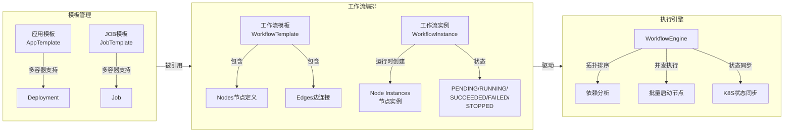
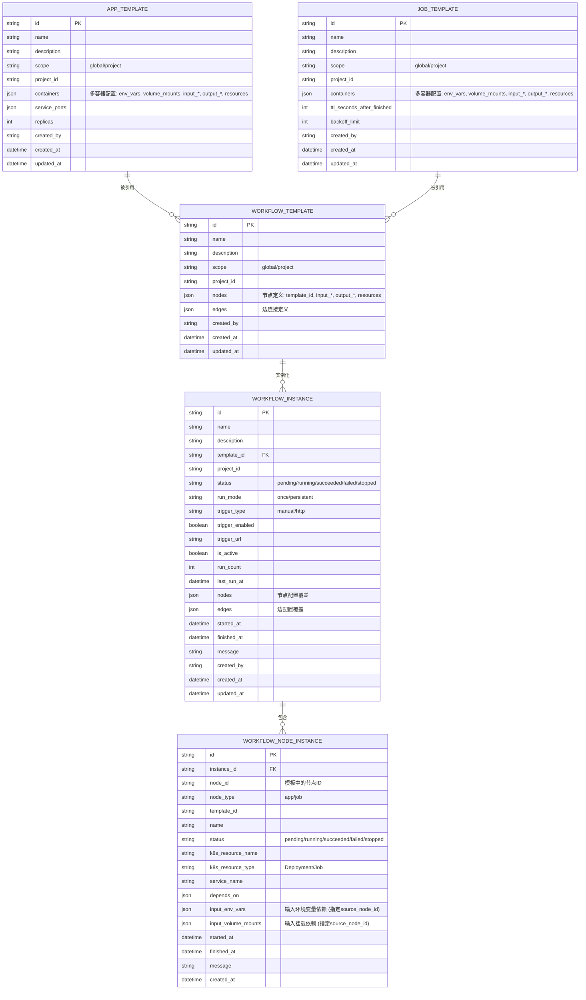
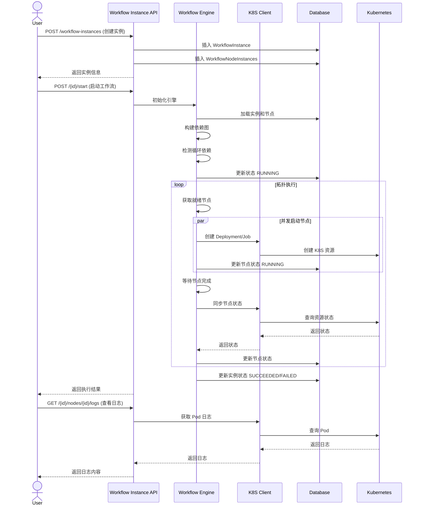
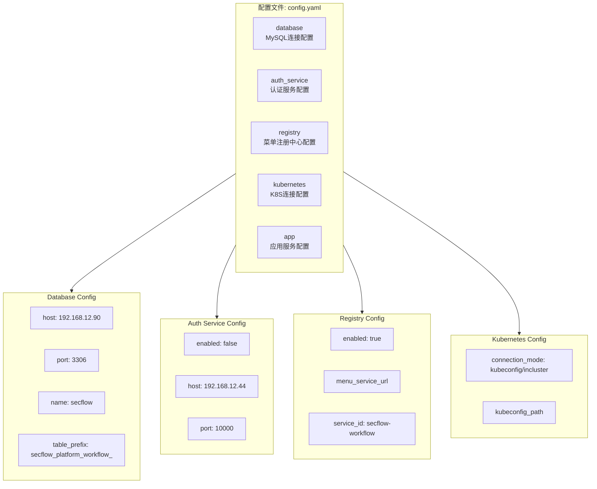

# SecFlow Workflow Service 架构图

## 系统架构概览

```mermaid
flowchart TB
    subgraph External["外部系统"]
        AuthService["SecFlow Auth Service<br/>(认证服务)"]
        MenuService["SecFlow Menu Service<br/>(菜单注册中心)"]
        K8SCluster["Kubernetes Cluster<br/>(K8S集群)"]
        MySQL["MySQL Database<br/>(数据持久化)"]
    end

    subgraph WorkflowService["SecFlow Workflow Service<br/>(工作流编排服务) :10009"]
        subgraph APILayer["API 层 (FastAPI)"]
            AppTemplateAPI["/api/workflow/app-templates<br/>应用模板管理"]
            JobTemplateAPI["/api/workflow/job-templates<br/>JOB模板管理"]
            WorkflowTemplateAPI["/api/workflow/workflow-templates<br/>工作流模板管理"]
            WorkflowInstanceAPI["/api/workflow/workflow-instances<br/>工作流实例管理"]
        end

        subgraph ServiceLayer["服务层"]
            AuthServiceClient["Auth Service Client<br/>(认证客户端)"]
            RegistryService["Registry Service<br/>(服务注册)"]
            K8SClient["K8S Client<br/>(K8S资源操作)"]
            WorkflowEngine["Workflow Engine<br/>(工作流执行引擎)"]
        end

        subgraph DataLayer["数据层 (SQLAlchemy)"]
            DB[(Database<br/>数据库)]
            AppTemplateModel["AppTemplate<br/>(应用模板模型)"]
            JobTemplateModel["JobTemplate<br/>(JOB模板模型)"]
            WorkflowTemplateModel["WorkflowTemplate<br/>(工作流模板模型)"]
            WorkflowInstanceModel["WorkflowInstance<br/>(工作流实例模型)"]
            WorkflowNodeInstanceModel["WorkflowNodeInstance<br/>(工作流节点实例模型)"]
        end
    end

    %% 外部连接
    AuthService <-->|"Token验证<br/>HTTP /api/auth/validate-human-token"| AuthServiceClient
    MenuService <-->|"服务注册/心跳/下线<br/>HTTP /api/menu/*"| RegistryService
    K8SCluster <-->|"Deployment/Job/Service/PVC<br/>K8S API"| K8SClient
    MySQL <-->|"CRUD操作<br/>MySQL TCP"| DB

    %% API层连接
    AppTemplateAPI --> AppTemplateModel
    JobTemplateAPI --> JobTemplateModel
    WorkflowTemplateAPI --> WorkflowTemplateModel
    WorkflowInstanceAPI --> WorkflowInstanceModel
    WorkflowInstanceAPI --> WorkflowNodeInstanceModel

    %% 服务层连接
    APILayer -.->|"依赖注入"| ServiceLayer
    WorkflowEngine --> K8SClient
    WorkflowEngine --> WorkflowInstanceModel
    WorkflowEngine --> WorkflowNodeInstanceModel
    WorkflowEngine --> AppTemplateModel
    WorkflowEngine --> JobTemplateModel

    %% 认证流程
    AppTemplateAPI -.->|"JWT Token验证"| AuthServiceClient
    JobTemplateAPI -.->|"JWT Token验证"| AuthServiceClient
    WorkflowTemplateAPI -.->|"JWT Token验证"| AuthServiceClient
    WorkflowInstanceAPI -.->|"JWT Token验证"| AuthServiceClient

    classDef external fill:#e1f5fe,stroke:#01579b,stroke-width:2px
    classDef api fill:#fff3e0,stroke:#ef6c00,stroke-width:2px
    classDef service fill:#e8f5e9,stroke:#2e7d32,stroke-width:2px
    classDef data fill:#f3e5f5,stroke:#6a1b9a,stroke-width:2px

    class AuthService,MenuService,K8SCluster,MySQL external
    class AppTemplateAPI,JobTemplateAPI,WorkflowTemplateAPI,WorkflowInstanceAPI api
    class AuthServiceClient,RegistryService,K8SClient,WorkflowEngine service
    class DB,AppTemplateModel,JobTemplateModel,WorkflowTemplateModel,WorkflowInstanceModel,WorkflowNodeInstanceModel data
```



---

## 核心模块说明



---

## 数据模型关系图



---

## 工作流执行流程



---

## API 端点一览

| 模块 | 端点 | 功能 |
|------|------|------|
| **应用模板** | `GET /api/workflow/app-templates` | 列出应用模板 |
| | `POST /api/workflow/app-templates` | 创建应用模板 |
| | `GET /api/workflow/app-templates/{id}` | 获取模板详情 |
| | `PUT /api/workflow/app-templates/{id}` | 更新模板 |
| | `DELETE /api/workflow/app-templates/{id}` | 删除模板 |
| **JOB模板** | `GET /api/workflow/job-templates` | 列出JOB模板 |
| | `POST /api/workflow/job-templates` | 创建JOB模板 |
| | `GET /api/workflow/job-templates/{id}` | 获取模板详情 |
| | `PUT /api/workflow/job-templates/{id}` | 更新模板 |
| | `DELETE /api/workflow/job-templates/{id}` | 删除模板 |
| **工作流模板** | `GET /api/workflow/workflow-templates` | 列出工作流模板 |
| | `POST /api/workflow/workflow-templates` | 创建工作流模板 |
| | `GET /api/workflow/workflow-templates/{id}` | 获取模板详情 |
| | `PUT /api/workflow/workflow-templates/{id}` | 更新模板 |
| | `DELETE /api/workflow/workflow-templates/{id}` | 删除模板 |
| **工作流实例** | `GET /api/workflow/workflow-instances` | 列出工作流实例 |
| | `POST /api/workflow/workflow-instances` | 创建工作流实例 |
| | `GET /api/workflow/workflow-instances/{id}` | 获取实例详情 |
| | `PUT /api/workflow/workflow-instances/{id}` | 更新实例配置 |
| | `POST /api/workflow/workflow-instances/{id}/start` | 启动工作流 |
| | `POST /api/workflow/workflow-instances/{id}/stop` | 停止工作流 |
| | `POST /api/workflow/workflow-instances/{id}/sync-status` | 同步状态 |
| | `POST /api/workflow/workflow-instances/{id}/activate` | 激活持久化工作流 |
| | `POST /api/workflow/workflow-instances/{id}/deactivate` | 停用持久化工作流 |
| | `DELETE /api/workflow/workflow-instances/{id}` | 删除实例 |
| | `GET /api/workflow/workflow-instances/{id}/nodes/{id}/logs` | 获取节点日志 |
| **触发器** | `POST /api/workflow/workflow-instances/triggers/{id}` | HTTP触发工作流 |

---

## 配置说明



---

## 技术栈

| 层级 | 技术 |
|------|------|
| **Web框架** | FastAPI |
| **数据库** | MySQL + SQLAlchemy |
| **配置** | PyYAML + Pydantic |
| **K8S交互** | kubernetes-python |
| **服务注册** | httpx (异步HTTP) |
| **基础镜像** | python:3.11-slim |

---

## 核心特性

1. **多容器支持**: 应用模板和JOB模板都支持多容器配置
2. **工作流编排**: 基于DAG拓扑排序的并发执行引擎
3. **依赖管理**:
   - 支持环境变量传递 (`input_env_vars`)
   - 支持PVC共享挂载 (`input_volume_mounts`)
   - 支持PVC子目录挂载 (`sub_path`)
4. **资源管理**:
   - 支持定义最小资源请求 (`requests`)
   - 支持定义资源限制 (`limits`)
   - 工作流节点可继承并覆盖模板资源
5. **运行模式**:
   - **一次性运行 (once)**: 工作流执行一次后结束
   - **持久化运行 (persistent)**: 工作流持续有效，节点可以是app(Deployment)或job(Job)
6. **触发器机制**:
   - **手动触发 (manual)**: 通过API手动启动
   - **HTTP触发 (http)**: 通过HTTP请求自动触发工作流
   - 支持激活/停用控制
7. **状态同步**: 实时同步K8S资源状态到数据库
8. **权限控制**: 基于JWT Token的用户认证和权限检查
9. **服务注册**: 自动向菜单中心注册服务并发送心跳

---

## 目录结构

```
secflow-platform-workflow/
├── app/
│   ├── api/                    # API路由层
│   │   ├── app_templates.py    # 应用模板API
│   │   ├── job_templates.py    # JOB模板API
│   │   ├── workflow_templates.py   # 工作流模板API
│   │   └── workflow_instances.py   # 工作流实例API
│   ├── models/                 # 数据模型层
│   │   └── database.py         # SQLAlchemy模型定义
│   ├── schemas/                # Pydantic模式定义
│   │   └── schemas.py          # 请求/响应模式
│   ├── services/               # 业务逻辑层
│   │   ├── auth.py             # 认证服务
│   │   ├── registry.py         # 服务注册
│   │   ├── k8s.py              # K8S客户端
│   │   └── workflow_engine.py  # 工作流执行引擎
│   ├── config.py               # 配置管理
│   ├── exception.py            # 异常处理
│   ├── dependencies.py         # FastAPI依赖
│   └── main.py                 # 应用入口
├── config.yaml                 # 配置文件
├── Dockerfile                  # Docker构建文件
├── requirements.txt            # Python依赖
└── ARCHITECTURE.md             # 本文档
```

---

## 工作流引擎执行逻辑

### 1. 依赖图构建
- 从工作流模板的 edges 定义构建依赖关系
- 支持节点级别的 depends_on 显式依赖
- 使用 DFS 算法检测循环依赖

### 2. 拓扑执行
- 计算每个节点的入度(in-degree)
- 入度为0的节点作为起始节点
- 并发启动所有就绪节点
- 等待节点完成后更新依赖图
- 重复直到所有节点执行完毕

### 3. 状态管理
- **PENDING**: 等待依赖满足
- **RUNNING**: 已创建K8S资源，正在运行
- **SUCCEEDED**: 成功完成
- **FAILED**: 执行失败
- **STOPPED**: 被用户停止

### 4. 依赖解析
- **环境变量依赖**: 从上游节点获取服务名或输出值
  - 模板级: `input_env_vars` (声明name)
  - 节点级: `input_env_vars` (指定source_node_id)
- **存储卷依赖**: 挂载上游节点创建的PVC
  - 模板级: `input_volume_mounts` (声明mount_path)
  - 节点级: `input_volume_mounts` (指定source_node_id)
- **执行顺序依赖**: 等待上游节点完成后再启动

### 5. 运行模式

#### 一次性运行 (once)
- 工作流启动后执行一次
- 所有节点执行完成后工作流结束
- 状态变为 SUCCEEDED 或 FAILED

#### 持久化运行 (persistent)
- 工作流创建后持续有效
- 支持两种触发方式:
  - **手动触发**: 通过 `/start` API 手动启动
  - **HTTP触发**: 通过 `/triggers/{id}` 端点触发
- 节点可以是:
  - **app**: Deployment 类型，持久运行
  - **job**: Job 类型，一次性执行
- 执行完成后保持节点状态，等待下一次触发
- 支持激活/停用控制 (`/activate`, `/deactivate`)
- 记录运行次数 (`run_count`) 和最后运行时间 (`last_run_at`)
